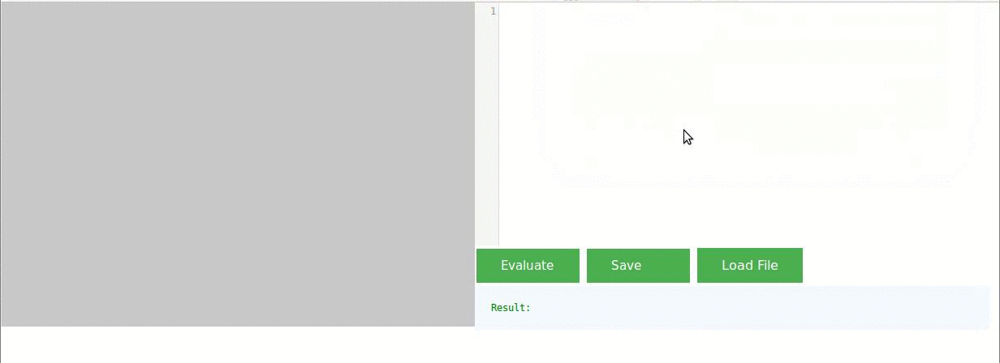

#Graph Algorithm Prototyper (GAP)

Build an example graph by clicking on the canvas on the left. Mobilize your JS skills and enter your algorithm on the right. Evaluate the algorithms output on the graph by clicking the left button.

